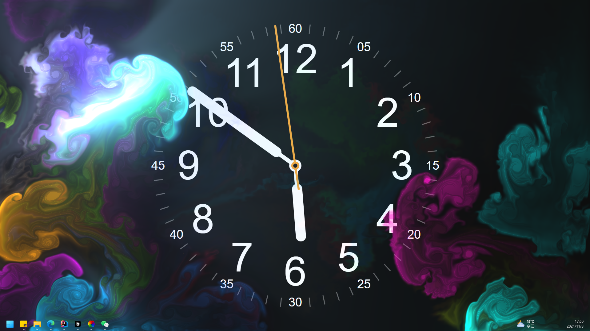

# Self Used Lively Wallpaper Fluid 

- Depend on https://github.com/rocksdanister/WebGL-Fluid-Simulation/releases
- Add Clock (from Steam WallPaper)
- Add Planet (from https://www.cnblogs.com/gangang/p/6087105.html)

## 

- Preview Onlilne: [https://robotism.github.io/lively-wallpaper-fluid-clock/](https://robotism.github.io/lively-wallpaper-fluid-clock/)

- Preview Video : [https://www.bilibili.com/video/BV1K4DzYxEZQ](https://www.bilibili.com/video/BV1K4DzYxEZQ)

> note: i have installed TranslucentTB also

## Usage

1. method 1
    download all of this repo files to lively theme dir
2. method 2
    add this online github page to lively

You can use [https://convertio.co/zh/webm-converter/](https://convertio.co/zh/webm-converter/) to convert gif to webm as background

## License

The code is available under the [MIT license](LICENSE)
